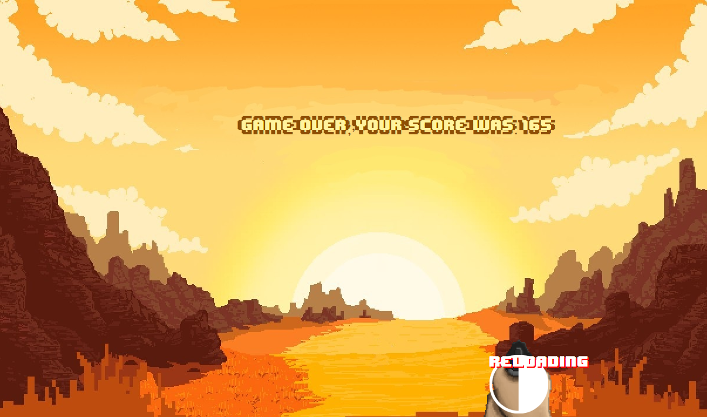
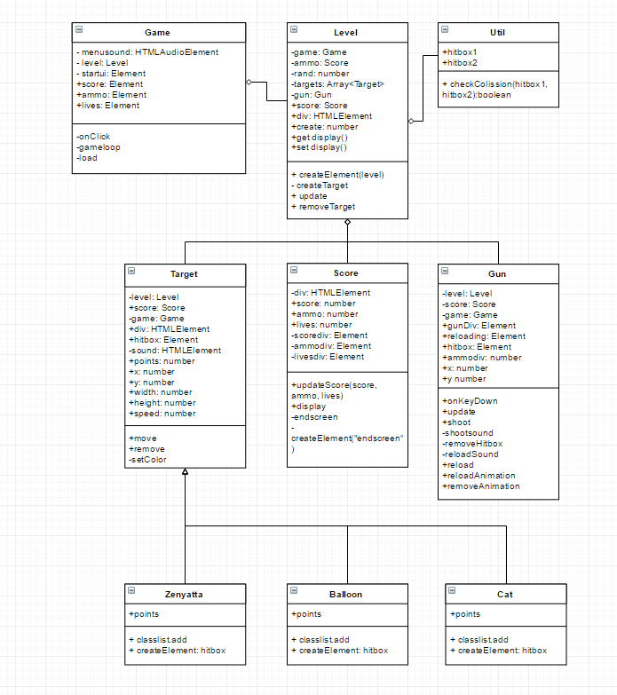

<h1># High Noon</h1>

Join Mccree in his training in the wild west. You play as a lonely cowboy that needs to shoot the balloons in order to practise his aim. His teacher is sometimes getting in the way so dont shoot him!

<h2><a href="https://harisspahija.github.io/HighNoon/">Click here to play!</a></h2> 

<h2>How to play</h2>
A = Move the gun Left 
D = Move the gun right 
Spacebar = Shoot 
R = Reload 

<h2>High Score</h2>
Gert https://github.com/GJeeh - 165 

 
Did you break the highscore? Post an issue and I will update it!
 
 
<h1>Programming 4</h1>
<h2>UML</h2>

<h2>Composition</h2>
My composition is shown above in my UML

<h2>Encapsulation</h2>
I used public and private keywords to re-use the same keywords. This way I was able to make a more organized code.

<h2>Inheritance</h2>
I used the targets for inheritance, I was planning on adding more guns so I could use inheritance for that aswell.
